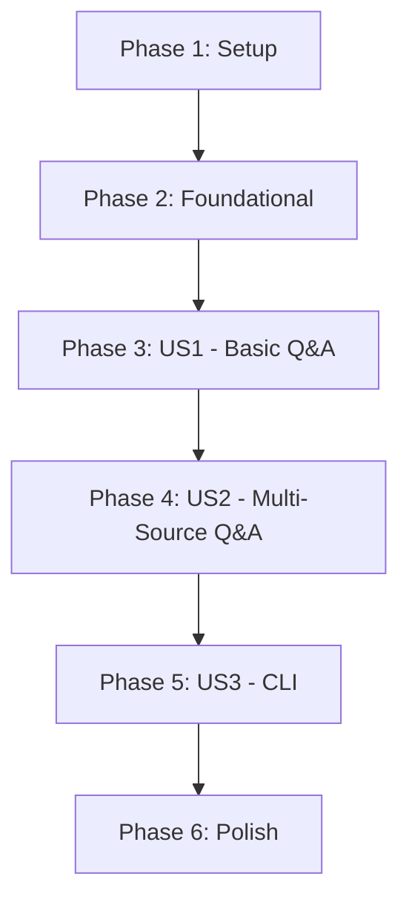

# Tasks for Feature: Agent Bot

This document outlines the tasks required to implement the Agent Bot feature. The tasks are organized into phases, with each phase representing a testable increment of functionality.

## Implementation Strategy

The implementation will follow a phased approach, starting with an MVP and incrementally adding features.

- **MVP (Phase 3):** A user can ask a question about a single website URL.
- **V1.1 (Phase 4):** A user can manage a persistent list of source URLs for the bot to use.
- **V1.2 (Phase 5):** A user can interact with the bot via a dedicated command-line interface.

## Dependencies

The completion of user stories should follow this order:

## Parallel Execution

Tasks marked with `[P]` can be worked on in parallel within their respective phases, as they are independent of other tasks in the same phase.

---

## Phase 1: Setup

These tasks focus on initializing the project and its dependencies.

- [X] T001 Create a new Python project structure in a `bot/` directory.
- [X] T002 Initialize a `requirements.txt` in `bot/requirements.txt` and add initial dependencies: `fastapi`, `uvicorn`, `langchain`, `beautifulsoup4`, `faiss-cpu`, `sentence-transformers`, `typer`.
- [X] T003 Create an empty `main.py` in `bot/main.py`.

---

## Phase 2: Foundational

These tasks create the core, reusable components.

- [X] T004 Implement a web content fetcher utility in `bot/utils/web_fetcher.py`.
- [X] T005 Implement a text splitting utility in `bot/utils/text_splitter.py`.
- [X] T006 Create an embedding manager service in `bot/services/embedding_service.py` to handle text vectorization.

---

## Phase 3: User Story 1 - Basic Q&A

**Goal:** A user can provide a single URL and a question to receive an answer based on its content.

**Test Criteria:** The system can answer a question from a specified URL via an API call.

- [X] T007 [US1] Create a data model for Q&A requests in `bot/models/qa_models.py`.
- [X] T008 [US1] Implement the core Q&A logic in `bot/services/qa_service.py` that takes a URL and question, fetches content, generates embeddings, and produces an answer.
- [X] T009 [US1] Create a FastAPI endpoint in `bot/main.py` to expose the basic Q&A functionality.
- [X] T010 [US1] Write a unit test for the `qa_service` in `tests/test_qa_service.py`.

---

## Phase 4: User Story 2 - Multi-Source Q&A

**Goal:** A user can manage a persistent list of URLs for the bot to use as its knowledge base.

**Test Criteria:** The system can add, remove, and list source URLs. The Q&A functionality now draws from all managed sources.

- [X] T011 [US2] Create a data model for sources in `bot/models/source_models.py`.
- [X] T012 [US2] Implement a source management service in `bot/services/source_service.py` to handle adding, removing, and listing URLs (persisting to a simple `sources.json` file for now).
- [X] T013 [US2] Modify `qa_service` in `bot/services/qa_service.py` to use a persistent vector store (e.g., FAISS index saved to disk) based on all managed sources.
- [X] T014 [P] [US2] Add API endpoint to `bot/main.py` for adding a source.
- [X] T015 [P] [US2] Add API endpoint to `bot/main.py` for removing a source.
- [X] T016 [P] [US2] Add API endpoint to `bot/main.py` for listing all sources.

---

## Phase 5: User Story 3 - CLI Interface

**Goal:** A user can interact with the bot through a command-line interface.

**Test Criteria:** A user can run CLI commands to add/remove sources and ask questions.

- [X] T017 [US3] Create a new CLI entry point script `bot/cli.py` using Typer.
- [X] T018 [US3] Implement CLI command `add-source <url>` in `bot/cli.py` to call the source management API.
- [X] T019 [US3] Implement CLI command `remove-source <url>` in `bot/cli.py`.
- [X] T020 [US3] Implement CLI command `list-sources` in `bot/cli.py`.
- [X] T021 [US3] Implement CLI command `ask <question>` in `bot/cli.py` to call the Q&A API.

---

## Phase 6: Polish & Cross-Cutting Concerns

These tasks address final touches and project-wide concerns.

- [X] T022 Add comprehensive error handling to all API endpoints in `bot/main.py`.
- [X] T023 Implement logging across all services in the `bot/` directory.
- [X] T024 Create a `README.md` for the bot in `bot/README.md`, documenting setup and usage.
