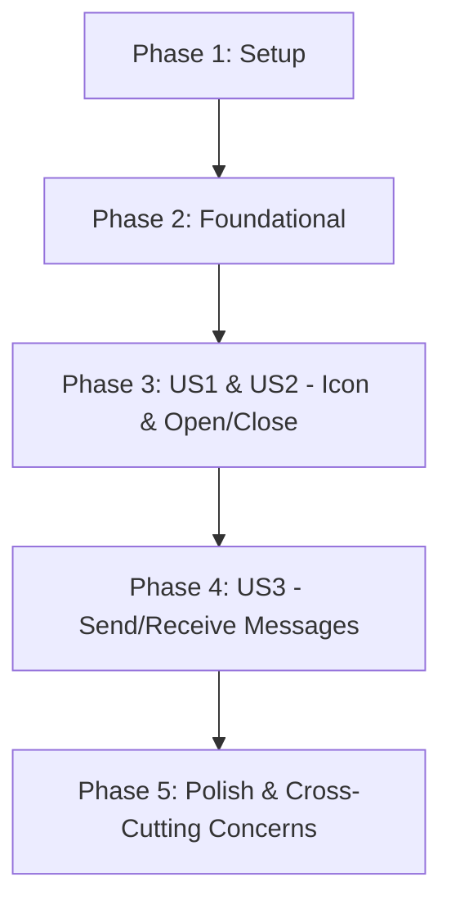

# Tasks for Feature: Chat Box UI

This document outlines the tasks required to implement the Chat Box UI feature. The tasks are organized into phases, with each phase representing a testable increment of functionality.

## Implementation Strategy

The implementation will follow a phased approach, starting with an MVP and incrementally adding features.

-   **MVP (Phase 3):** A user can see the chat icon and open/close the chat box.
-   **V1.1 (Phase 4):** A user can send and receive messages within the chat box, with state persistence.
-   **V1.2 (Phase 5):** Polish and documentation.

## Dependencies

The completion of user stories should follow this order:

## Parallel Execution

Tasks marked with `[P]` can be worked on in parallel within their respective phases, as they are independent of other tasks in the same phase.

---

## Phase 1: Setup

These tasks focus on initializing the project structure and primary dependencies.

- [X] T001 Create the base directory for the ChatBox UI component: `src/components/ChatBox/`.
- [X] T002 Initialize a new React project within `src/components/ChatBox/` (or adapt an existing one).
- [X] T003 Install core dependencies: `react`, `react-dom` (if not already present), `tailwindcss`, `axios`. (User needs to run `npm install` manually.)

---

## Phase 2: Foundational

These tasks set up shared utilities and base styling required across the component.

- [X] T004 Configure Tailwind CSS for the project (e.g., `tailwind.config.js` and CSS imports).
- [X] T005 Create `src/components/ChatBox/utils/storage.js` for `localStorage` management (e.g., `saveChatState`, `loadChatState`).
- [X] T006 Create `src/components/ChatBox/utils/api.js` for encapsulating backend API calls (e.g., `postQuestion`).

---

## Phase 3: User Story 1 - Display Chat Icon & User Story 2 - Open/Close Chat Box

**Goal:** Users can see a floating chat icon and toggle the chat box visibility.

**Test Criteria:** The chat icon is always visible and users can open/close the chat window by clicking the icon.

- [X] T007 [US1] Create `src/components/ChatBox/ChatIcon.js` to render the floating chat icon.
- [X] T008 [US1] Apply CSS styling for the `ChatIcon` to position it at the bottom-right and ensure it's always visible.
- [X] T009 [US2] Create `src/components/ChatBox/ChatWindow.js` to serve as the main container for the chat box.
- [X] T010 [US2] Implement toggle logic in `src/components/ChatBox/index.js` to show/hide `ChatWindow` when `ChatIcon` is clicked.
- [X] T011 [US2] Use `utils/storage.js` to persist the `is_open` state of the chat box in `localStorage`.
- [X] T012 [US2] Add basic styling for `ChatWindow` (positioning, size, background) to ensure it appears as an overlay.
- [X] T013 [US1/US2] Write unit/component tests for `ChatIcon.js` and `ChatWindow.js` and their toggle functionality.

---

## Phase 4: User Story 3 - Send and Receive Messages

**Goal:** Users can send messages and receive bot responses within the open chat box.

**Test Criteria:** Messages are correctly sent to the backend, responses are displayed, and chat history persists.

- [X] T014 [US3] Create `src/components/ChatBox/ChatMessage.js` to display individual messages (user or bot).
- [X] T015 [US3] Create `src/components/ChatBox/ChatInput.js` with an input field and send button/Enter key functionality.
- [X] T016 [US3] Create `src/components/ChatBox/ChatHistory.js` to render a scrollable list of `ChatMessage` components.
- [X] T017 [US3] Implement logic in `src/components/ChatBox/utils/api.js` to make `POST` requests to the backend `/qa` endpoint.
- [X] T018 [US3] Integrate message sending, receiving, and display into `src/components/ChatBox/index.js`, managing the `ChatSession` state.
- [X] T019 [US3] Use `utils/storage.js` to persist the `ChatSession` (including messages) in `localStorage`.
- [X] T020 [US3] Add styling for `ChatMessage`, `ChatInput`, and `ChatHistory` components.
- [X] T021 [US3] Write unit/component tests for message sending/receiving logic and state management.

---

## Phase 5: Polish & Cross-Cutting Concerns

These tasks address final touches, error handling, accessibility, and documentation.

- [X] T022 Implement user-friendly error handling and display messages for API failures (e.g., backend unavailable).
- [X] T023 Add visual indicators for message sending status (e.g., "typing..." or spinner).
- [X] T024 Ensure accessibility (ARIA attributes, keyboard navigation) for all interactive elements in the chat box.
- [X] T025 Create a `src/components/ChatBox/README.md` to document component usage, props, and integration instructions.
- [X] T026 Update the main application's `index.js` (or relevant entry point) to include and initialize the `ChatBox` component.
